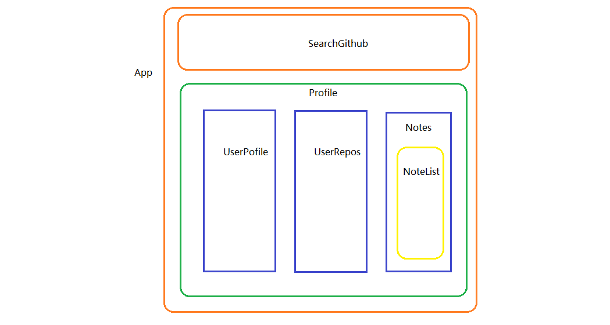

<h1 style="font-size: 40px;text-align:center;color: #007cdc;">github-notetaker应用开发</h1>

> 本次课程的完整代码在这里：https://github.com/GuoYongfeng/github-notetaker-app

## 介绍 INTRODUCTION

我们计划用最近所学的技术知识来完成一个完整且实用的功能应用，这个应用具有以下功能：

- 通过搜索github上的用户名来检索该用户的基本信息
- 可以检索到该用户的github上的所有代码仓库信息
- 可以对该用户进行简单的评论
- 通过特定路由可以访问特定用户的信息

大概是长这个样子

在看到了这个原型图之后，我们来做一件很重要的事情，使用组件化的思维来解析这个应用需求。

<h3 style="text-align: center;">github-notetaker-app整体组件划分示意图</h3>

