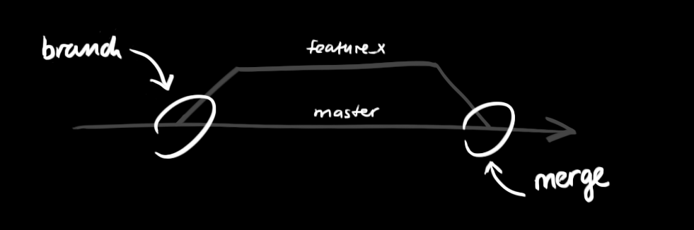

## git 分支操作

有人把 Git 的分支模型称为“必杀技特性”，而正是因为它，将 Git 从版本控制系统家族里区分出来。Git 有何特别之处呢？Git 的分支可谓是难以置信的轻量级，它的新建操作几乎可以在瞬间完成，并且在不同分支间切换起来也差不多一样快。和许多其他版本控制系统不同，Git 鼓励在工作流程中频繁使用分支与合并，哪怕一天之内进行许多次都没有关系。

理解分支的概念并熟练运用后，你才会意识到为什么 Git 是一个如此强大而独特的工具，并从此真正改变你的开发方式。

```
# 创建分支
git branch branch_name
# 本地切换到这个分支
git checkout branch_name
```

```
# 创建并且直接切换到这个新分支
git checkout -b branch_name
```

```
# 分支合并，比如将分支develop合并到master分支
git checkout master
git merge master develop
```


## 8.分支的管理

分支是用来将特性开发绝缘开来的。在你创建仓库的时候，master 是“默认的”。在其他分支上进行开发，完成后再将它们合并到主分支上。



我们可以首先创建一个分支

```
$ git branch mybranch
```

然后切换到这个分支

```
$ git checkout mybranch
```


或者可以更快一点，创建一个分支并且切换过去

```
$ git checkout -b mybranch
```


如果这个分支你不想要，也可以直接删除掉

```
$ git branch -d mybranch
```


如果你和其他小伙伴基于这个分支协作，那么你需要把这个分支push到远端仓库，不然的话，这个分支是存在于你的本地的，其他的小伙伴就看不到了。

```
$ git push origin mybranch
```

## 分支的更新与合并

要更新你的本地仓库至最新改动，执行：
```
git pull origin master
```
这样就将本地的master分支和远程同步了

也可以使用fetch和rebase来进行分支的更新

```
$ git fetch origin
$ git rebase origin/master
```

以在你的工作目录中 获取（fetch） 并 合并（merge） 远端的改动。
要合并其他分支到你的当前分支（例如 master），执行：
```
$ git merge <branch>
```

无论是分支的更新还是合并，git 都会尝试去自动合并改动。不幸的是，自动合并并非次次都能成功，并可能导致 冲突（conflicts）。 这时候就需要你修改这些文件来人肉合并这些 冲突（conflicts） 了。改完之后，你需要执行如下命令以将它们标记为合并成功：
```
$ git add <filename>
```

在合并改动之前，也可以使用如下命令查看：

```
$ git diff <source_branch> <target_branch>
```

处理冲突之后就可以commit了
```
$ git commit -m "fix conflict"
```
