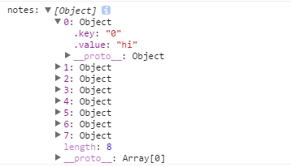

## 接入真实的数据

为了接入真实的数据，这里我们将用到几个新的知识点：
- [firebase](https://www.firebase.com/docs/web/quickstart.html)：是一个数据同步的云服务，帮助开发者开发具有「实时」（Real-Time）特性的应用，让我们实现真正的无后端编程，有木有很厉害，啊哈哈...
- reactfire: 一个react的mixin库，封装了六个组件公共的方法(bindAsArray,unbind,bindAsObject...)，专门用于处理React和Firebase集成的mixin方法，几行代码轻松获取数据，叼炸天...


首先下载这两个库
```
$ npm install --save reactfire firebase
```

然后在代码中引入：
```
import ReactFireMixin from 'reactfire';
import Firebase from 'firebase';
```

其中提到reactfire是一个mixin库，但是我们目前使用的是ES6语法写的，而不幸的是，ES6不支持mixin的写法，所以，我们只能想其他的办法，想知道更多请看[这里](http://zhuanlan.zhihu.com/purerender/20361937).

看完这篇文章后，我觉得我们可以用decorator来实现mixin的写法，比如在代码中这样写：
```
function testable(target) {
  target.isTestable = true;
}

@testable
class MyTestableClass {}

console.log(MyTestableClass.isTestable) // true
```

我们接着使用core-decorators提供的mixin来做重用模块的叠加，首先下载：
```
$ npm install --save core-decorators
```

然后在代码中引入这样就可以使用了
```
import { mixin } from 'core-decorators';

@mixin(ReactFireMixin)
class Profile extends Component {
 ...
}
```

这还没完成，我们目前使用的是decorator，但是浏览器不支持这个写法啊，怎么办，我们让babel来编译解决这个问题吧。首先需要下载一个能解析decorator的babel插件，然后在.babelrc里面配置：
```
$ npm install babel-plugin-transform-decorators-legacy --save-dev
```

配置.babrelrc
```
{
  "presets": ["es2015", "stage-0", "react"],
  "plugins": ["transform-runtime", "transform-decorators-legacy"]
}

```

so，目前为止，我们可以在代码中使用reactfire这个mixin类库以及decorator语法。

现在贴出Profile组件完整的代码：`app/containers/Profile/Profile.jsx`
```
import React, { Component } from 'react';
import { UserProfile, UserRepos, Notes } from '../../components';
import { mixin } from 'core-decorators';
import ReactFireMixin from 'reactfire';
import Firebase from 'firebase';

@mixin(ReactFireMixin)
class Profile extends Component {
  state = {
    notes: ['1', '2', '3'],
    bio: {
      name: 'guoyongfeng'
    },
    repos: ['a', 'b', 'c']
  }
  componentDidMount(){
    // 为了读写数据，我们首先创建一个firebase数据库的引用
    this.ref = new Firebase('https://github-note-taker.firebaseio.com/');
    // 调用child来往引用地址后面追加请求，获取数据
    var childRef = this.ref.child(this.props.params.username);
    // 将获取的数据转换成数组并且赋给this.state.notes
    this.bindAsArray(childRef, 'notes');
  }
  componentWillUnMount(){
    this.unbind('notes');
  }
  render(){
    return (
      <div className="row">
        <div className="col-md-4">
          <UserProfile
            username={this.props.params.username}
            bio={this.state.bio} />
        </div>
        <div className="col-md-4">
          <UserRepos
            username={this.props.params.username}
            repos={this.state.repos} />
        </div>
        <div className="col-md-4">
          <Notes
            username={this.props.params.username}
            notes={this.state.notes} />
        </div>
      </div>
    )
  }
}

export default Profile

```

现在通过firebase获取的是notes的数据，我们到Notes组件来看一下传过来的是什么数据.
代码清单：`app/components/Notes/Notes.jsx`

```
import React, { Component } from 'react';

export default class Notes extends Component {
  render(){
    console.log('notes:', this.props.notes);

    return (
      <div>
        <p> 评论 </p>
      </div>
    )
  }
}

```

数据是长这样子的：


