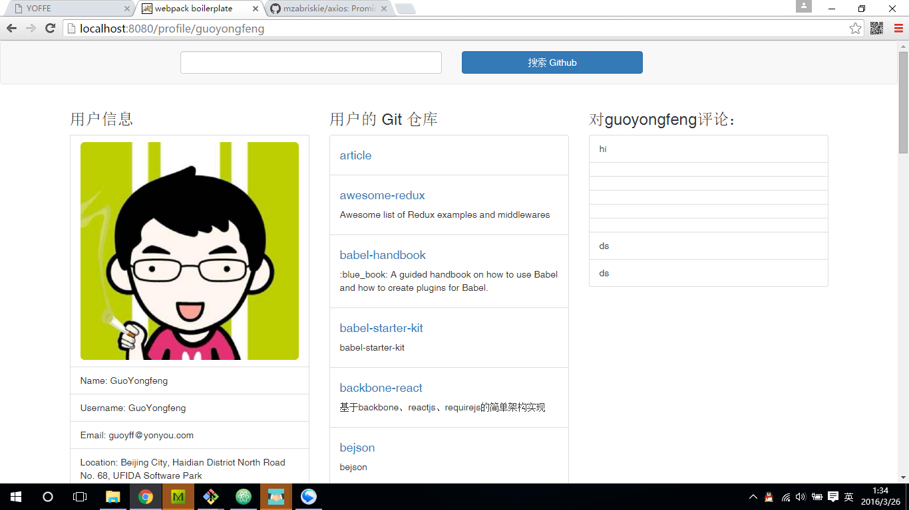

## 将数据传入组件进行展示

从第10步我们已经妥妥的把数据取回来了，那么接下来的事情将变得轻松，我们这需要将数据传入组件，修改组件的UI进行展示即可。甚至，你完全可以做个和github官网一样漂亮的首页。let's do it....

首先，来完善一下UserRepos组件吧
代码清单：`app/components/UserRepos/UserRepos.jsx`
```
import React, { Component, PropTypes } from 'react';

export default class UserRepos extends Component {
  static propTypes = {
    username: PropTypes.string.isRequired,
    repos: PropTypes.array.isRequired
  }
  render(){
    console.log('repos:', this.props.repos);

    let repos = this.props.repos.map( (repo, index ) => {
      return (
        <li className="list-group-item" key={index}>
          {repo.html_url && <h4><a href={repo.html_url}>{repo.name}</a></h4>}
          {repo.description && <p>{repo.description}</p>}
        </li>
      )
    });

    return <div>
      <h3> 用户的 Git 仓库 </h3>
      <ul className="list-group">
        {repos}
      </ul>
    </div>
  }
}

```

然后，完善一下UserProfile组件，代码清单：`app/components/UserProfile/UserProfile.jsx`

```
import React, { Component, PropTypes } from 'react';

export default class UserProfile extends Component {
  static propTypes = {
    username: PropTypes.string.isRequired,
    bio: PropTypes.object.isRequired
  }
  render(){
    let bio = this.props.bio;
    return (
      <div>
        <h3> 用户信息 </h3>
          {bio.avatar_url && <li className="list-group-item"> </li>}
          {bio.name && <li className="list-group-item">Name: {bio.name}</li>}
          {bio.login && <li className="list-group-item">Username: {bio.login}</li>}
          {bio.email && <li className="list-group-item">Email: {bio.email}</li>}
          {bio.location && <li className="list-group-item">Location: {bio.location}</li>}
          {bio.company && <li className="list-group-item">Company: {bio.company}</li>}
          {bio.followers && <li className="list-group-item">Followers: {bio.followers}</li>}
          {bio.following && <li className="list-group-item">Following: {bio.following}</li>}
          {bio.public_repos && <li className="list-group-item">Public Repos: {bio.public_repos}</li>}
          {bio.blog && <li className="list-group-item">Blog: <a href={bio.blog}> {bio.blog}</a></li>}
      </div>
    )
  }
}

```

查看一下效果吧



## 结语

完整的示例代码在这里：https://github.com/GuoYongfeng/github-notetaker-app

本次课程内容比较丰富，请按课程步骤执行操作，遇到问题请请issue：https://github.com/GuoYongfeng/github-notetaker-app/issues
